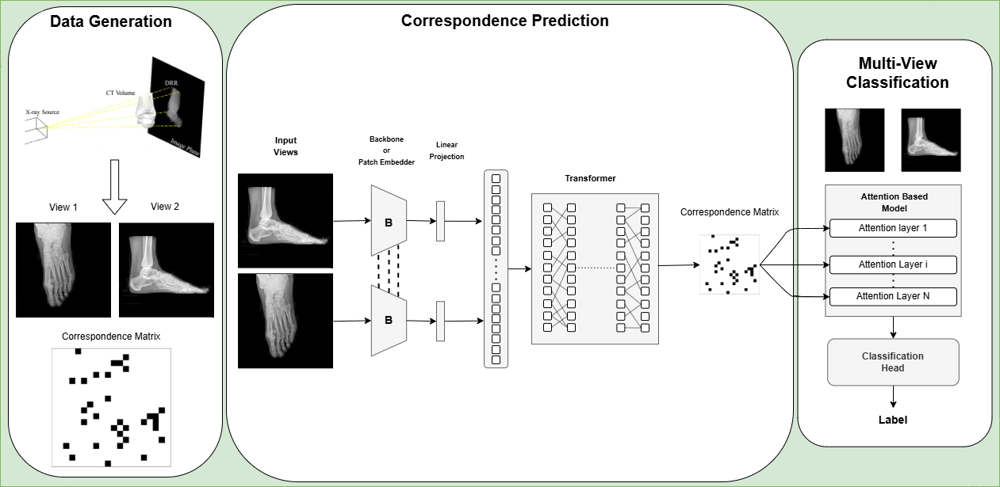

# Multiview Xray Matching

[](#MICCAI)
[![CC BY-NC-SA 4.0][cc-by-nc-sa-shield]][cc-by-nc-sa]
[![CC BY-NC-SA 4.0][cc-by-nc-sa-image]][cc-by-nc-sa]

[cc-by-nc-sa]: http://creativecommons.org/licenses/by-nc-sa/4.0/
[cc-by-nc-sa-image]: https://licensebuttons.net/l/by-nc-sa/4.0/88x31.png
[cc-by-nc-sa-shield]: https://img.shields.io/badge/License-CC%20BY--NC--SA%204.0-lightgrey.svg

<p align="center">
  
</p>

This repository provides the official implementation of our paper:

**“Self-Supervised Multiview Xray Matching”**  
*Mohamad Dabboussi, Malo Huard, Yann Gousseau, Pietro Gori*  
Accepted at **MICCAI 2025**.

---

## 📝 Overview

This project introduces a self-supervised framework to match anatomical correspondences across multiview X-ray images without requiring manual annotations. The method is designed to enhance downstream tasks such as pose estimation and classification by leveraging geometric and appearance-based consistency across views.


## 🔧 Setup

### Environment Setup

Our experiments were tested with the following versions, other versions may also work:
- **Python version** >= 3.9.x
- **PyTorch version**: 2.7.0
```bash
pip install torch==2.6.0 --index-url https://download.pytorch.org/whl/cu124
```
- **PyTorch Lightning version**: 2.2.2
```bash
pip install pytorch-lightning==2.2.2
```

- Install all dependencies via:

```bash
pip install -r requirements.txt
```

## 📁 Data Generation

All CT volumes should be organised in the following structure:

```
Multiview_xray_matching/
├── configs/
├── dataset/
│   └── ct_volumes/
│       ├── volume_1/
│       │   ├── volume_1_1.dcm
│       │   └── volume_1_2.dcm
│       │   └── ....
│       ├── volume_2/
│       └── ...
├── src/
├── ...
```

To generate data, run:

```bash
python src/data/create_csv.py
python src/data/generate_data.py
```

These scripts will:

* Generate the `data.csv` file
* Generate the `data.h5` dataset file

Both output files will be located in the `dataset` folder.


## ✨ Correspondence Data Augmentation

The following data augmentation techniques are implemented to improve model robustness.
These augmentations preserve consistency between the views and the correspondence matrix.

* **Geometric Transformations**: random rotations and horizontal flips
* **Masked Crop**: crops a region of the image and masks the rest
* **Cutout**: introduces random black square regions within the image
* **Shift**: applies spatial shifts along x and y axes

All augmentations are configurable within the dataset pipeline.


## 🏋️‍♂️ Correspondence Training and Prediction

Train the correspondence matching model by running:

```bash
python main.py --config configs/config.yml
```

Ensure the config file is set with the correct dataset paths and hyperparameters for your experiments.


## 📊 Visualization

Visualization scripts are provided to inspect data samples, correspondences, and model predictions. Use them to qualitatively assess model performance and dataset characteristics.

## 📄 Citation

If you use this code for your research, please cite our paper.

<!-- ```
@inproceedings{dabboussi2025multiview,
  title={Self-Supervised Multiview Xray Matching},
  author={Dabboussi, Mohamad and Huard, Malo and Gousseau, Yann and Gori, Pietro},
  booktitle={MICCAI},
  year={2025}
}
``` -->


## 🤝 Contact

For questions or collaboration inquiries, please contact us.

---